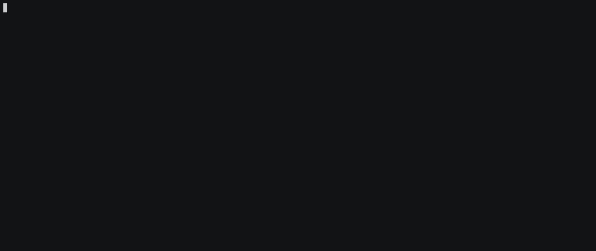

The simplest machine learning library for deploying prototypes, conducting quality assurance, and tracking production model performance. 

#### Preview


## Usage

### Installation

Catacomb's Python library can be installed from the PyPi registry:

```
pip install catacomb-ai
```

To test installation, run `catacomb`:

```
Usage: catacomb [OPTIONS] COMMAND [ARGS]...

Options:
  --help  Show this message and exit.

Commands:
  build
  push
  run
```

### Required Files

The only file Catacomb expects is a `system.py` file that implements a class containing the `__init__` and `output` methods:

```python
import catacomb

class UppercaseModel:
    def __init__(self):
        """Initializing system and loading dependencies"""
        self.variable = True

    def output(self, input):
        """Performing inference and returning a prediction"""
        return input.upper()
        
if __name__ == "__main__":
    catacomb.connect(UppercaseModel, 'TEXT')
```

Implementing the system interface allows Catacomb to auto-generate a UI for the system/model from the command line tool. Model hosting will fail unless all dependencies are defined within the current directory (i.e. a `Pipfile` or `requirements.txt` file is required).

Running Catacomb locally can be done by running `python system.py`. 

### Deployment
You can deploy model to the Catacomb's hosting service by calling `catacomb upload` from the command-line.

Make sure to include dependencies for `system.py` in a `Pipfile` and corresponding `Pipfile.lock` if using [Pipenv](https://pypi.org/project/pipenv/), or in a `requirements.txt` file!


#### External Dependencies
Catacomb will install any packages specified in the `Pipfile` or `requirements.txt` into the model image and will copy all contents of the current directory to the image, as well as managing the image in Catacomb's container registry.

Additional external dependencies can be installed by specifying a `catacomb.sh` bash file to run on the created image. This file is detected during the `catacomb build` process.

## License
MIT
